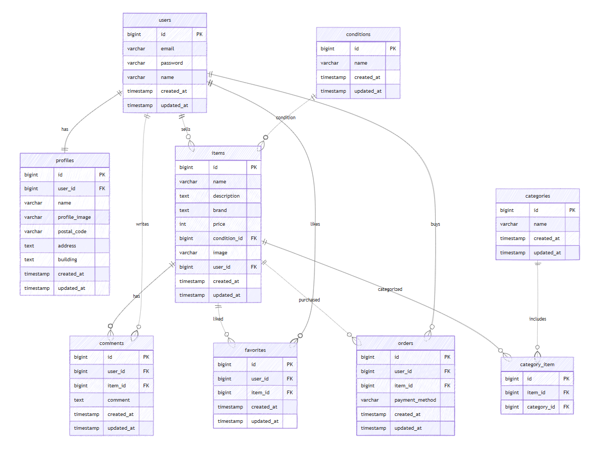

# Coachtech Flea Market App（模擬案件）

## 環境構築

### Docker ビルド

1. リポジトリをクローン

```bash
git clone git@github.com:yutaka-fujise/Flea-market-app.git
```

2.プロジェクトディレクトリへ移動

```bash
cd Flea-market-app
```

3.DockerDesktop アプリを起動

4.Docker コンテナをビルド・起動

```bash
docker-compose up -d --build
```

※Mac の M1・M2 チップの PC の場合

no matching manifest for linux/arm64/v8 in the manifest list entries
のエラーが表示され、ビルドできない場合があります。

その際は docker-compose.yml の mysql サービスに
以下の記述を追加してください。

mysql:
platform: linux/x86_64
image: mysql:8.0.26

## Laravel 環境構築

1.PHP コンテナに入る

```bash
docker-compose exec php bash
```

2.パッケージをインストール

```bash
composer install
```

3. .env ファイルを作成

```bash
cp .env.example .env
```

4. .env に以下の環境変数を追加(11行目から16行目を以下に変更してください)
   DB_CONNECTION=mysql
   DB_HOST=mysql
   DB_PORT=3306
   DB_DATABASE=laravel_db
   DB_USERNAME=laravel_user
   DB_PASSWORD=laravel_pass

5.アプリケーションキーの作成

```bash
php artisan key:generate
```

6.マイグレーションの実行

```bash
php artisan migrate
```

7.シーディングの実行

```bash
php artisan db:seed
```

8.シンボリックリンク作成

```bash
php artisan storage:link
```

## 使用技術（実行環境）

- PHP 8.x
- Laravel 10.x
- MySQL 8.0
- Docker / Docker Compose

## 機能一覧

- ユーザー登録 / ログイン（Fortify）
- 商品一覧表示
- 商品詳細表示
- 商品出品
- 商品購入
- いいね（お気に入り）
- コメント投稿
- マイページ（出品履歴 / 購入履歴）

## テーブル設計

※ 後ほど追記

## ER 図


## URL

・開発環境：http://localhost

・phpMyAdmin：http://localhost:8080/

## 補足

・認証機能には Laravel Fortify を使用しています。

・Docker 環境下での再現性を重視した構成としています。
