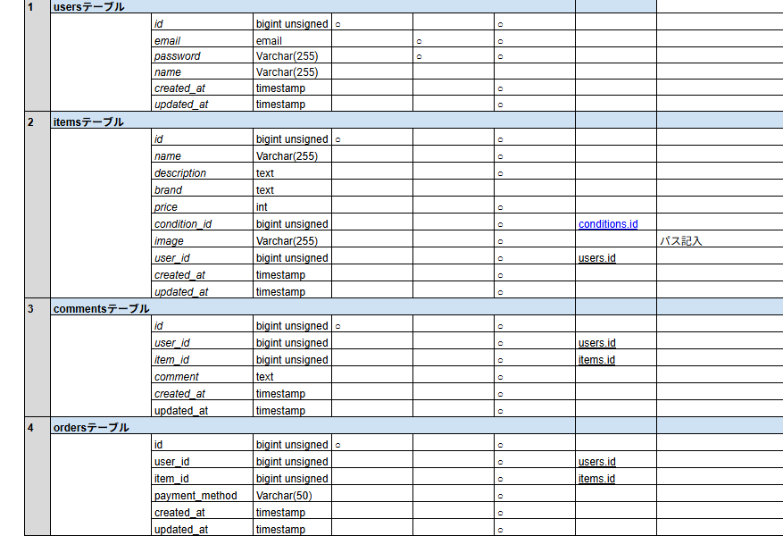
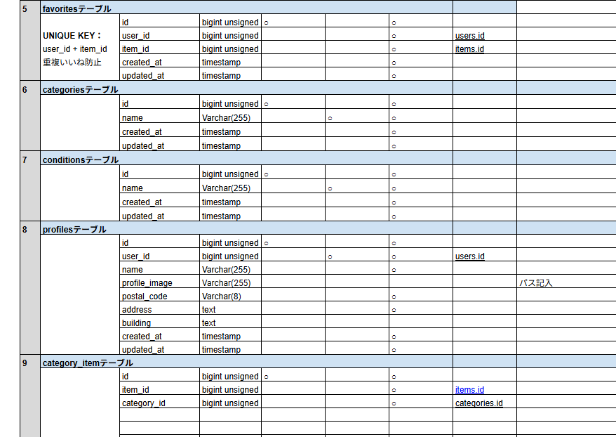
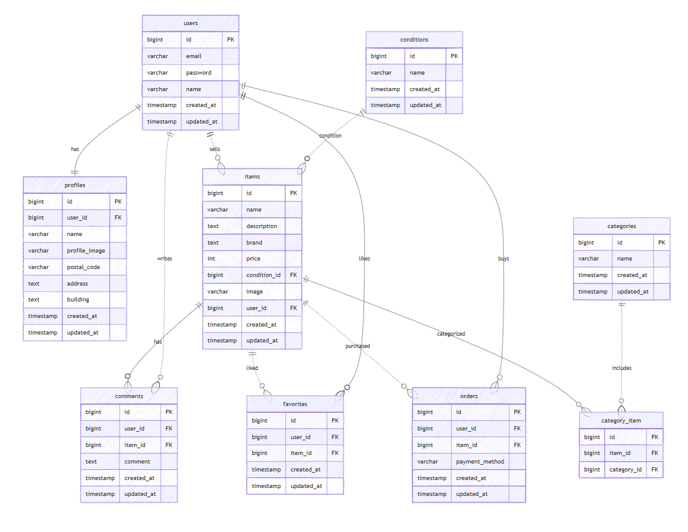

# Coachtech Flea Market App（模擬案件）

## 環境構築

### Docker ビルド

1. リポジトリをクローン

```bash
git clone git@github.com:yutaka-fujise/Flea-market-app.git
```

2.プロジェクトディレクトリへ移動

```bash
cd Flea-market-app
```

3.DockerDesktop アプリを起動

4.Docker コンテナをビルド・起動

```bash
docker-compose up -d --build
```

※Mac の M1・M2 チップの PC の場合

no matching manifest for linux/arm64/v8 in the manifest list entries
のエラーが表示され、ビルドできない場合があります。

その際は docker-compose.yml の mysql サービスに
以下の記述を追加してください。

```yaml
mysql:
  platform: linux/x86_64
  image: mysql:8.0.26
```

## Laravel 環境構築

1.PHP コンテナに入る

```bash
docker-compose exec php bash
```

2.パッケージをインストール

```bash
composer install
```

3. .env ファイルを作成

```bash
cp .env.example .env
```

環境によっては .env ファイル編集時に権限エラーが発生する場合があります。
その場合は以下を実行してください。
```bash
chmod 666 .env
```

4. .env のデータベース設定を確認してください
```env
DB_HOST=mysql
DB_PORT=3306
DB_DATABASE=laravel_db
DB_USERNAME=laravel_user
DB_PASSWORD=laravel_pass
```

5.アプリケーションキー作成と権限設定

```bash
php artisan key:generate
```

Laravelが書き込みを行うディレクトリの権限設定
```bash
chmod -R 777 storage bootstrap/cache
```

商品画像保存用ディレクトリ作成
```bash
mkdir -p storage/app/public/items
```
```bash
chmod -R 777 storage/app/public
```

6.マイグレーションとシーディングの実行

```bash
php artisan migrate --seed
```

7.シンボリックリンク作成

```bash
php artisan storage:link
```

8.Stripe 設定（購入機能）

Stripe を使用した決済機能があります。
.env に以下を設定してください。

```env
STRIPE_KEY=your_stripe_public_key
STRIPE_SECRET=your_stripe_secret_key
```

Stripe テストカード
```text
4242 4242 4242 4242
```

## 使用技術（実行環境）

- PHP 8.x
- Laravel 10.x
- MySQL 8.0
- Docker / Docker Compose
- Laravel Fortify
- Stripe Checkout

## 機能一覧

- ユーザー登録 / ログイン（Fortify）
- メール認証
- 商品一覧表示
- 商品詳細表示
- 商品出品
- 商品購入
- いいね（お気に入り）
- コメント投稿
- マイページ（出品履歴 / 購入履歴）

## テーブル設計



## ER 図


## URL

・開発環境：http://localhost

・phpMyAdmin：http://localhost:8080/

・ログイン画面：http://localhost/login

## 補足

・認証機能には Laravel Fortify を使用しています。

・Docker 環境下での再現性を重視した構成としています。

・模擬案件の機能要件等のスプレッドシート
https://docs.google.com/spreadsheets/d/1OMHE-XLXVo0V99Ws5XlLwZ3zTcRgfJHEWecwW41gmO0/edit?gid=1188247583#gid=1188247583